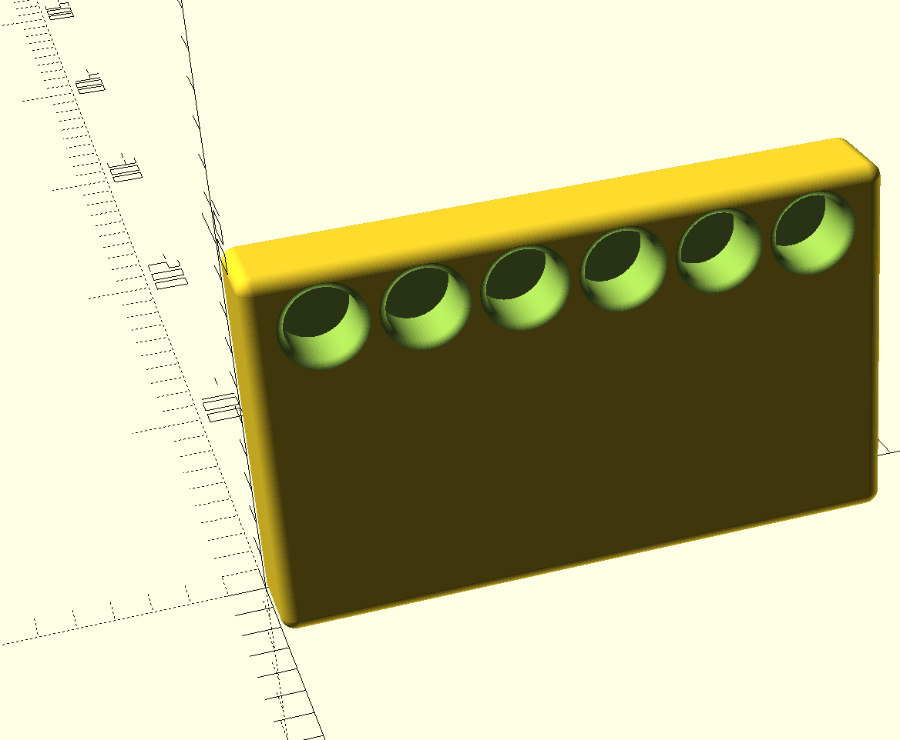

# dowel-deskshelf

A parametric OpenSCAD design for a desk shelf: 3D-printed wall brackets on
each end hold wooden dowels that span wall-to-wall as the shelf surface.

## Status

First milestone: the wall brackets. Each bracket sits flush to the wall
and has a row of bored sockets that dowel ends press/slide into, plus a
slot for the slide-in shelf panel. How the bracket actually attaches to
the wall comes later.

## Layout

```
scad/
  lib/params.scad    shared dimensions (dowel size, bracket size, dowel row, shelf slot/panel)
  lib/bracket.scad    shared bracket geometry, included by both wall.scad and wall_mirrored.scad
  wall.scad           the wall bracket, left half
  wall_mirrored.scad  the wall bracket, right half (mirror image of wall.scad)
  shelf.scad          the slide-in shelf panel
export/               generated STLs (gitignored, run `make` to produce)
```

## Building

Requires the [OpenSCAD](https://openscad.org/) CLI.

```
make                 # render every scad/*.scad to export/*.stl (both brackets + the shelf)
make wall            # render just the left bracket
make wall_mirrored   # render just the right bracket
make shelf           # render just the shelf panel
make clean           # remove generated STLs
```

Or render/preview directly:

```
openscad scad/wall.scad          # open in the OpenSCAD GUI
openscad -o export/wall.stl scad/wall.scad
```

## Versions

A rendered image of each meaningful revision is kept under `docs/images/`
for a visual record of how the design evolved.

### v0

Wall bracket: 6-dowel row along the top edge, rounded corners, filleted
dowel bore openings, rubber foot recesses on the bottom face.



## Tuning to your dowels and wall

Edit `scad/lib/params.scad`:

- `dowel_diameter_in` / `dowel_tolerance` — set to your actual dowel stock
  (inches); tolerance controls press-fit vs. slide-fit.
- `dowel_bore_depth` — how far the dowel is captured inside the bracket.
- `dowel_length_in` — length of your dowel stock (inches); the shelf
  panel's length (`shelf_length`) is derived from this so it spans the
  same wall-to-wall gap.
- `num_dowels` — how many dowels the bracket holds.
- `dowel_min_wall` / `dowel_edge_margin` — plastic left between/around the
  dowel bores; `wall_bracket_width` is derived from these automatically.
- `wall_bracket_height/depth` — outer size of the printed block.
- `shelf_thickness` — thickness of your printed shelf panel stock; sizes
  both the slot and the panel.
- `shelf_slot_depth` — how far the panel is captured inside each bracket.
