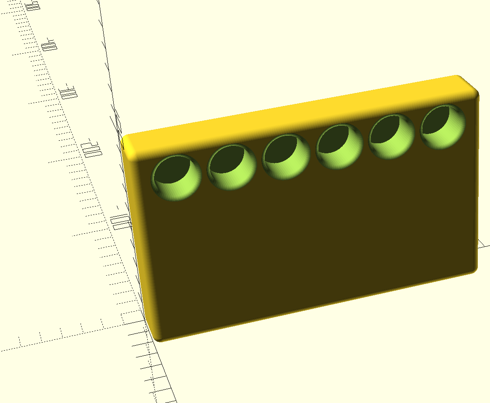

# dowel-deskshelf

A parametric OpenSCAD design for a desk shelf: 3D-printed wall brackets on
each end hold wooden dowels that span wall-to-wall as the shelf surface.

## Status

First milestone: the wall brackets. Each bracket sits flush to the wall
and has a row of bored sockets that dowel ends press/slide into, plus a
slot for the slide-in shelf panel. How the bracket actually attaches to
the wall comes later.

## Components

Each of these is printed on its own (see Building below) and combined
physically to assemble the shelf.

- **`wall.scad`** / **`wall_mirrored.scad`** — the two end brackets that
  mount to the wall at each side of the shelf. Each has a row of bored
  sockets that one end of each dowel presses/slides into, plus a slot
  that the shelf panel slides into. `wall_mirrored.scad` is a mirror
  image of `wall.scad` so the dowels and panel are captured at both
  ends of the span.
- **`wall_through.scad`** / **`wall_through_mirrored.scad`** — an
  intermediate bracket for the same dowel row, used partway along a long
  span instead of at a wall. Unlike the end brackets, the dowels pass
  all the way through rather than stopping blind, so the run can
  continue past it (e.g. into a second segment covered by another tray
  or shelf panel). It still has the same shelf-panel slot as the end
  brackets.
- **`shelf.scad`** — the flat, slide-in shelf panel. Its two ends are
  captured by the slot in a pair of brackets, spanning the same
  wall-to-wall gap as the dowels; its length is derived from your dowel
  stock length so the two line up.
- **`tray.scad`** — an alternative, flat-top surface that rests on top
  of the dowels instead of (or alongside) the slide-in panel: a slab
  with a half-round channel on the underside for each dowel, with
  snap-fit clips around the two outer dowels so it clips down onto the
  row rather than just resting loose. Sized to fit a typical 256x256mm
  print bed, so a long run is covered by printing multiple trays end to
  end.
- **`cord_tray.scad`** — a skinny tray covering only the first couple of
  dowels (`cord_tray_dowels`), clipped on like `tray.scad`, with a fin
  hanging from its low-Y edge. The fin has hooked slots: a cord slides in from
  below and hooks sideways into a pocket so it can't fall out, and
  oversized plugs stay outside since only the cord passes the entry.
- **`half_shelf.scad`** — a shorter, reinforced version of the shelf
  panel for spots where a full wall-to-wall panel doesn't make sense —
  e.g. supporting a laptop that sits across a gap between two brackets.
  It slides into the same bracket slot as `shelf.scad` on only one end
  and cantilevers out toward the middle, with extra material tapered in
  near the slot (where the bending load is highest) for stiffness, and
  an optional drop-down leg to rest on the desk if the cantilever alone
  isn't stiff enough. Print one against each of the two brackets
  bounding the gap; they meet with a small gap in the middle rather than
  needing to align perfectly.

## Layout

```
scad/
  lib/params.scad    shared dimensions (dowel size, bracket size, dowel row, shelf slot/panel)
  lib/bracket.scad    shared bracket geometry, included by both wall.scad and wall_mirrored.scad
  wall.scad           the wall bracket, left half
  wall_mirrored.scad  the wall bracket, right half (mirror image of wall.scad)
  shelf.scad          the slide-in shelf panel
  tray.scad           flat-top tray that rests on the dowels, channels on the underside cradle each one
  cord_tray.scad      skinny tray with a hanging fin of hooked cord slots
  half_shelf.scad     reinforced half-length shelf panel, cantilevered from one bracket's slot
export/               generated STLs (gitignored, run `make` to produce)
```

## Building

Requires the [OpenSCAD](https://openscad.org/) CLI.

```
make                 # render every scad/*.scad to export/*.stl (both brackets + the shelf)
make wall            # render just the left bracket
make wall_mirrored   # render just the right bracket
make shelf           # render just the shelf panel
make clean           # remove generated STLs
```

Or render/preview directly:

```
openscad scad/wall.scad          # open in the OpenSCAD GUI
openscad -o export/wall.stl scad/wall.scad
```

## Versions

A rendered image of each meaningful revision is kept under `docs/images/`
for a visual record of how the design evolved.

### v0

Wall bracket: 6-dowel row along the top edge, rounded corners, filleted
dowel bore openings, rubber foot recesses on the bottom face.



## Tuning to your dowels and wall

Edit `scad/lib/params.scad`:

- `dowel_diameter_in` / `dowel_tolerance` — set to your actual dowel stock
  (inches); tolerance controls press-fit vs. slide-fit.
- `dowel_bore_depth` — how far the dowel is captured inside the bracket.
- `dowel_length_in` — length of your dowel stock (inches); the shelf
  panel's length (`shelf_length`) is derived from this so it spans the
  same wall-to-wall gap.
- `num_dowels` — how many dowels the bracket holds.
- `dowel_min_wall` / `dowel_edge_margin` — plastic left between/around the
  dowel bores; `wall_bracket_width` is derived from these automatically.
- `wall_bracket_height/depth` — outer size of the printed block.
- `shelf_thickness` — thickness of your printed shelf panel stock; sizes
  both the slot and the panel.
- `shelf_slot_depth` — how far the panel is captured inside each bracket.
- `shelf_corner_radius` — corner rounding on both `shelf.scad` and
  `half_shelf.scad`.
- `tray_wrap_depth` — how far the tray's outer clips wrap past the dowel
  centerline; increase (toward the dowel radius) for a tighter snap.
- `half_shelf_length` / `half_shelf_taper_length` / `half_shelf_root_height`
  — tune `half_shelf.scad` (a shorter, reinforced shelf panel that
  cantilevers from a single bracket's slot instead of spanning
  wall-to-wall — e.g. for a laptop resting across two of these bridging
  a gap) to your span and desired stiffness; `half_shelf_leg_drop` adds
  an optional support leg down to the desk if the cantilever alone isn't
  stiff enough.
